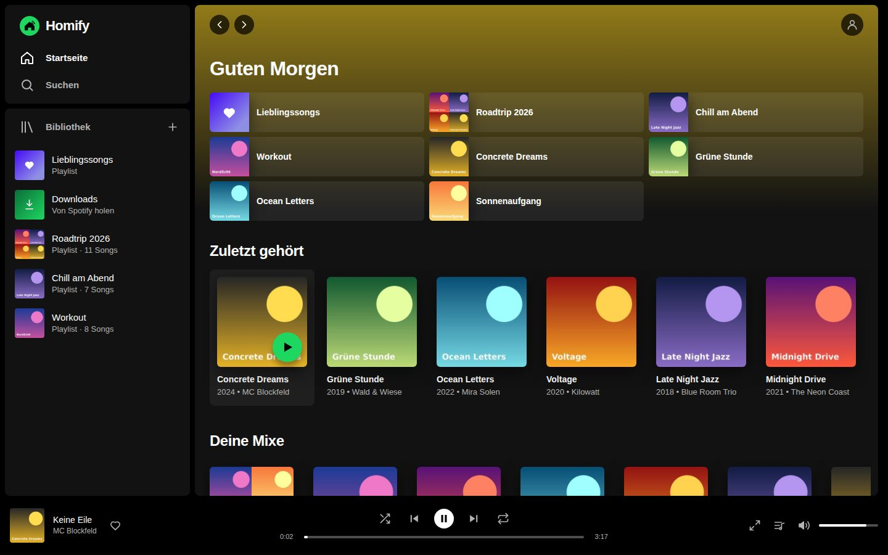
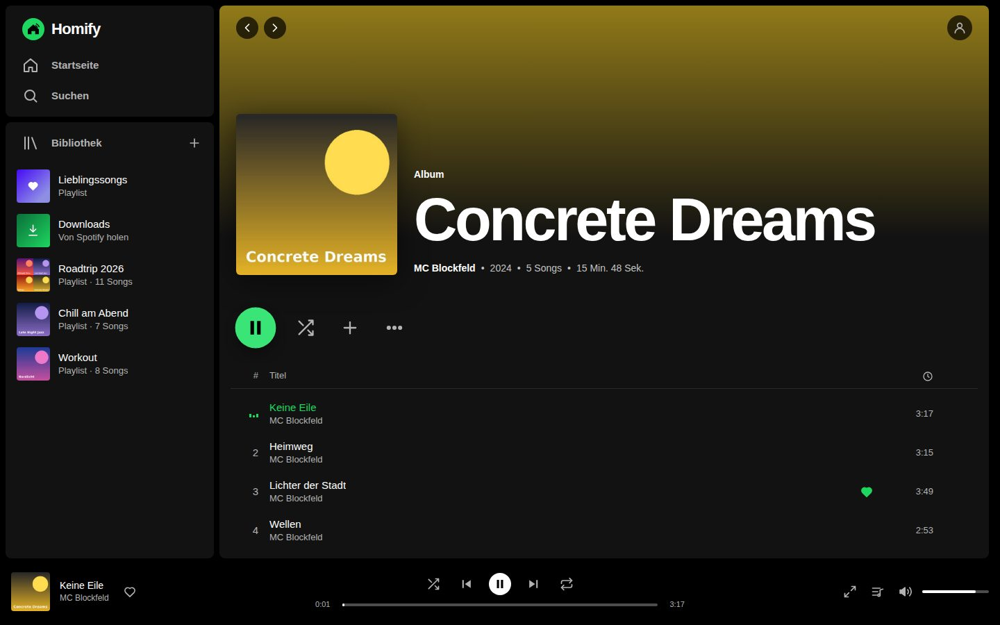
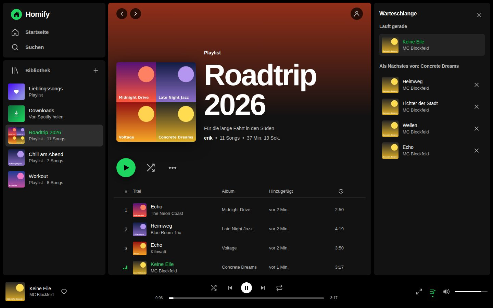
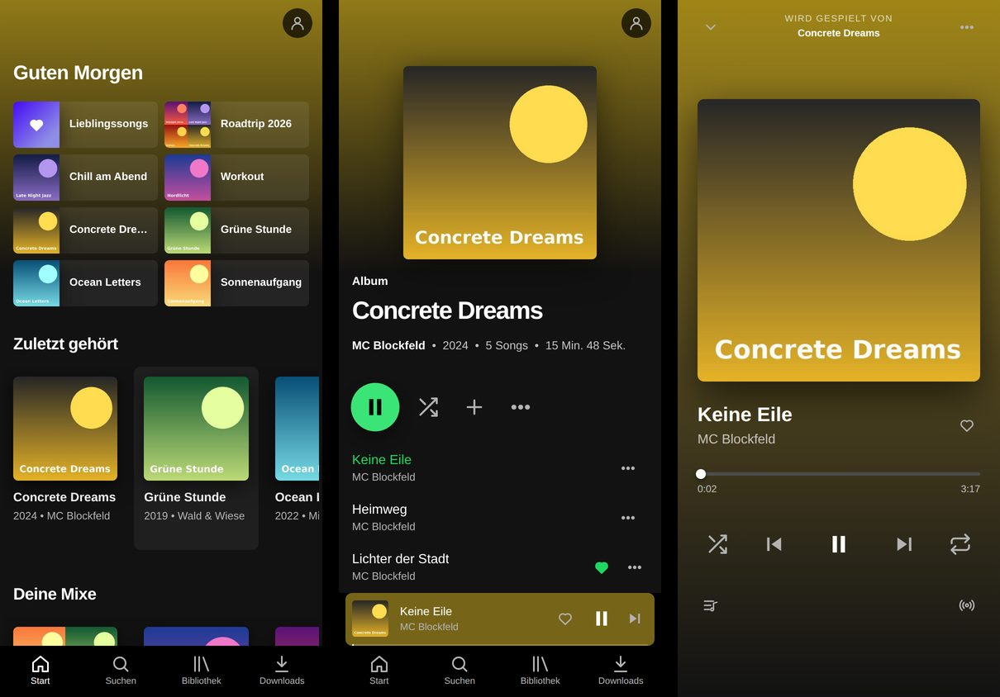

# Homify – dein eigenes Spotify fürs Homelab

Homify sieht aus und fühlt sich an wie Spotify, spielt aber **deine eigene Musik** – gespeichert
auf deinem NAS (z. B. UGREEN), gestreamt von deinem Homeserver auf Handy, PC und Browser, zuhause
und unterwegs. Fehlt ein Song, suchst du ihn einfach oder fügst einen Spotify-Link ein: Homify zeigt
passende Vorschläge von Spotify und holt den Song per [spotDL](https://github.com/spotDL/spotify-downloader)
in deine Bibliothek.



| Album | Playlist mit Warteschlange |
|---|---|
|  |  |



## Das Prinzip: ein zentrales Programm, drei Wege zum Hören

```
                          ┌────────────────────────────────────┐
  Android-App (APK) ──┐   │  Homify-Server                     │      ┌─────────────────┐
  Windows-App (.exe) ─┼──►│  Ubuntu-Homeserver                 │─SMB─►│  UGREEN-NAS     │
  Website (Browser) ──┘   │  (zum Testen: dein Windows-PC)     │      │  /Musik/…       │
     zuhause: WLAN/LAN    │  Bibliothek · Streaming · Download │      └─────────────────┘
     unterwegs: Tailscale └────────────────────────────────────┘
```

- **Der Homify-Server** ist das zentrale Programm. Er kennt deine Bibliothek, streamt die Musik,
  lädt fehlende Songs über spotDL und verwaltet Benutzer, Playlists und Lieblingssongs.
- **Speicherort:** Solange kein NAS eingestellt ist, speichert Homify alles im eigenen App-Ordner
  (`data/music`) – perfekt zum Testen auf Windows. Trägst du in Homify dein **UGREEN-NAS** ein,
  überträgt Homify alle Songs dorthin (jede Datei wird geprüft) und speichert ab dann alles auf dem NAS.
  Playlists und Lieblingssongs bleiben erhalten.
- **Apps:** Die Android-App und die Windows-App fragen beim ersten Start nach der Server-Adresse.
  Die Website ist einfach die Server-Adresse im Browser.
- **Von überall:** Mit [Tailscale](https://tailscale.com) sind Handy und PC auch unterwegs sicher
  mit dem Homeserver verbunden – ohne Router-Einstellungen und ohne offenen Port im Internet.

## Was Homify kann

- **Spotify-Look**: Startseite mit Schnellzugriff, Suche, Bibliothek, Alben, Künstler, Playlists,
  Lieblingssongs, Warteschlange, Zufall/Wiederholen, Vollbild-Player, Kontextmenüs, Tastenkürzel.
- **Infos und Cover aus den Dateien**: Titel, Künstler, Album, Jahr, Genre, Tracknummer und
  eingebettete Cover (oder `cover.jpg`/`folder.jpg` im Ordner).
- **Alle Songs funktionieren**: MP3, M4A/AAC, FLAC, OGG, Opus und WAV laufen direkt. WMA, ALAC,
  APE, WavPack, AIFF, DSD … wandelt Homify automatisch um – auch direkt vom NAS.
- **Fehlt ein Song? Holen!** Name oder Spotify-Link (Song, Album, Playlist, Künstler) eingeben,
  Homify zeigt die Treffer, markiert, was du schon hast, und holt den Rest mit einem Klick.
- **Mehrere Benutzer** mit eigenen Playlists, Lieblingssongs und Verlauf.
- **Extras**: Genre-Mixe, Zufallsmix, Song-Radio, Autoplay, Songtexte (mitlaufend), Überblenden,
  Equalizer, Lautstärke angleichen, Sperrbildschirm-/Kopfhörer-Steuerung, Datensparmodus für
  unterwegs, tägliche Sicherung.
- **100 Einstellungen**, alle sofort gespeichert – siehe unten.

## Die 100 Einstellungen

Unter **Einstellungen** (Konto-Symbol oben rechts). Oben gibt es eine Suche und Sprungmarken zu jeder
Gruppe. Geänderte Werte sind markiert und lassen sich mit ↺ auf den Standard zurücksetzen.

**54 persönliche Einstellungen** – gelten für dein Konto auf allen Geräten (Website, Handy, PC):

| Gruppe | Was du einstellen kannst |
|---|---|
| Wiedergabe (15) | Qualität im WLAN und bei mobilen Daten, Überblenden (0–12 s), lückenlose Wiedergabe, Autoplay, Lautstärke angleichen (pro Song/Album, leise/normal/laut), sanft pausieren, Geschwindigkeit, letzte Warteschlange wiederherstellen, „Zurück“-Verhalten, Sprungweite, ab wann ein Song als gehört zählt, private Sitzung, intelligenter Zufall |
| Equalizer (8) | Ein/Aus, 11 Voreinstellungen (Bass, Rock, Pop, Klassik …), 6 Regler von 60 Hz bis 15 kHz |
| Aussehen (15) | Design (Dunkel, Schwarz/AMOLED, Gedämpft), 8 Akzentfarben, Farben aus dem Cover, Größe der Oberfläche (85–140 %), Kachelgröße, kompakte Listen, Cover/Album-Spalte in Listen, Animationen, Startseite beim Öffnen, Abspielen mit einem Klick, Restzeit, Nachfragen vor dem Löschen, Tastenkürzel, Songtext-Knopf |
| Startseite (9) | Jede Reihe einzeln ein-/ausblenden, Einträge pro Reihe |
| Suche & Bibliothek (7) | Spotify-Vorschläge automatisch oder per Knopf, vorhandene Songs ausblenden, Start-Tab und Sortierung der Bibliothek, geholte Songs automatisch liken, Songs pro Mix |

**46 Server-Einstellungen** – nur für Admins, gelten für alle:

| Gruppe | Was du einstellen kannst |
|---|---|
| Bibliothek & Scan (12) | Scan-Intervall, Scan beim Start, gleichzeitig gelesene Dateien (Last fürs NAS), kurze Dateien und Ordner ignorieren, Ordnername als Album, Künstler/Titel aus dem Dateinamen, „feat.“-Gäste, Trennzeichen, `cover.jpg` bevorzugen, Sicherheitsgrenze gegen versehentliches Löschen (z. B. wenn das NAS kurz weg ist), Lautheit messen |
| Streaming (6) | Format beim Umwandeln (MP3/AAC/Opus), Bitraten, Cache-Größe, gleichzeitige Umwandlungen, Download aufs Gerät erlauben |
| Downloads (spotDL) (19) | Format, Bitrate, Threads, Dateinamen-Vorlage, Songtexte mitladen, SponsorBlock, Audio-Quellen, Explicit überspringen, Dateinamen vereinfachen, automatische Wiederholung, Tageslimit pro Benutzer, Recht für neue Benutzer, wöchentliches spotDL-Update, Aufräumen, Cookies, eigene Spotify-API |
| Server & Sicherheit (9) | Name des Servers, Erreichbarkeit (Netzwerk oder nur dieser Rechner), Port, Anmeldedauer, Verlauf aufbewahren, tägliche Sicherung + Anzahl, Protokoll, eigener ffmpeg-Pfad |

Dazu kommen die Bereiche **Speicherort (NAS)**, **Zugriff/Tailscale**, **Benutzer**, **Sicherung**
und **System** (Neustart, Versionen). Empfehlungen für den Ubuntu-Server mit UGREEN-NAS:
*Gleichzeitig gelesene Dateien* 4–8, *Sicherheitsgrenze* 30 %, *Tägliche Sicherung* an,
*Format beim Umwandeln* AAC oder Opus, *Qualität bei mobilen Daten* „Niedrig“.

---

## Schritt 1 – Zum Testen auf Windows

1. Repository herunterladen: **Code → Download ZIP**, entpacken nach z. B. `C:\Homify`.
2. `windows\Installieren.bat` doppelklicken. Das Skript installiert bei Bedarf Python, alle Pakete
   und spotDL, legt eine Desktop-Verknüpfung an und gibt den Port in der Windows-Firewall frei.
3. Homify öffnet sich – Admin-Konto anlegen. Fertig: Die Musik liegt erstmal im App-Ordner
   `C:\Homify\data\music`.
4. Songs suchen und holen, Playlists anlegen, alles ausprobieren.

Weitere Skripte im Ordner `windows`: `Starten-mit-Konsole.bat` (mit Protokoll), `Beenden.bat`,
`Autostart-einrichten.bat`, `Aktualisieren.bat`.

## Schritt 2 – UGREEN-NAS einstellen

In Homify: **Einstellungen → Speicherort der Musik → NAS**

| Feld | Was eintragen |
|---|---|
| NAS-Adresse | IP des NAS, z. B. `192.168.1.50` (steht in UGOS unter Systemsteuerung → Netzwerk oder im Router) |
| Freigegebener Ordner | Name des freigegebenen Ordners, z. B. `Musik` |
| Unterordner | z. B. `Musik` – wird angelegt, falls er fehlt (leer = direkt in der Freigabe) |
| Benutzer / Passwort | dein UGOS-Benutzer mit Lese- und Schreibrechten für den Ordner |

Vorher auf dem NAS (UGOS Pro): **SMB aktivieren** (Systemsteuerung → Dateidienste → SMB) und in
der App „Dateien“ einen freigegebenen Ordner anlegen. Die Menünamen können je nach UGOS-Version
leicht abweichen.

Dann **Verbindung testen** → **Speicherort übernehmen**. Mit „Vorhandene Musik übertragen“ kopiert
Homify alle Songs aufs NAS, prüft jede Datei und löscht sie erst dann im App-Ordner
(„Kopie am alten Ort behalten“ lässt sie liegen). Ist das NAS mal aus, löscht Homify **nichts**
aus der Bibliothek.

## Schritt 3 – Auf den Ubuntu-Homeserver umziehen

Ein Befehl holt Homify und richtet alles ein (Dienst mit Autostart, Firewall, Tailscale mit HTTPS):

```bash
curl -fsSL https://raw.githubusercontent.com/ErikEdits/Homelab-spotify-/main/ubuntu/bootstrap.sh | bash
```

oder von Hand:

```bash
git clone https://github.com/ErikEdits/Homelab-spotify-.git ~/homify
cd ~/homify
./ubuntu/install.sh            # fragt, was eingerichtet werden soll (--all = alles)
```

Danach:

1. Im Browser `http://<IP-des-Servers>:8484` öffnen.
2. **Sicherung mitnehmen:** auf dem Windows-Test-PC unter *Einstellungen → Sicherung* herunterladen,
   auf dem Server unter *Einstellungen → Sicherung einspielen*. Damit sind Benutzer, Playlists,
   Lieblingssongs und Einstellungen da.
3. Auf dem Server den Speicherort **NAS** eintragen (wie in Schritt 2). Liegt die Musik schon auf
   dem NAS, einfach „Vorhandene Musik übertragen“ abwählen – Homify liest das NAS ein, und weil die
   Pfade gleich sind, passen alle Playlists und Lieblingssongs.
4. Den Windows-PC brauchst du dann nicht mehr als Server (`windows\Beenden.bat`).

Nützlich auf dem Server: `systemctl status homify`, `journalctl -u homify -f`,
Update: `cd ~/homify && git pull && ./ubuntu/install.sh --service`.

## Schritt 4 – Apps für Handy und PC

In Homify unter **Apps** (Benutzermenü oben rechts) stehen die Download-Knöpfe und die
Server-Adressen. Die Apps werden automatisch von GitHub gebaut:
**[Releases → neueste Version](https://github.com/ErikEdits/Homelab-spotify-/releases/latest)**

| | Download | Einrichtung |
|---|---|---|
| **Android** | `Homify.apk` | Auf dem Handy öffnen, „Installation aus dieser Quelle zulassen“, Server-Adresse eintragen |
| **Windows** | `Homify-Setup.exe` | Installieren (bei „Unbekannter Herausgeber“: *Weitere Informationen → Trotzdem ausführen*), Server-Adresse eintragen |
| **Website** | – | Server-Adresse im Browser öffnen |

Beide Apps nehmen zwei Adressen: die **Heimnetz-Adresse** (`http://192.168.x.x:8484`) und die
**Adresse für unterwegs** (`https://<server>.<tailnet>.ts.net`). Sie nehmen automatisch die, die
gerade erreichbar ist.

Die Android-App spielt im Hintergrund weiter, zeigt Titel und Cover in der Benachrichtigung und
auf dem Sperrbildschirm und reagiert auf Bluetooth-Kopfhörer. Die Windows-App hat Medientasten und
Wiedergabe-Knöpfe in der Taskleisten-Vorschau.

## Von unterwegs: Tailscale

1. Auf dem Server: `./ubuntu/install.sh --tailscale` (macht auch die HTTPS-Adresse).
   Falls HTTPS nicht klappt: in der [Tailscale-Verwaltung](https://login.tailscale.com/admin/dns)
   *MagicDNS* und *HTTPS Certificates* einschalten, dann in Homify unter *Einstellungen → Zugriff*
   auf **HTTPS-Adresse einrichten** klicken.
2. Auf Handy und PC die Tailscale-App installieren und mit **demselben Konto** anmelden.
3. Die `https://…ts.net`-Adresse als „Adresse für unterwegs“ in die Apps eintragen.

**Keine Portweiterleitung am Router nötig** – und bitte auch keine einrichten.

---

## Songs holen, die du nicht hast (spotDL)

1. **Suchen** öffnen, Songnamen tippen oder Spotify-Link einfügen.
2. Unter deinen Treffern erscheint **„Nicht dabei? Von Spotify holen“**. Was du schon hast, ist
   mit **„In Bibliothek“** markiert.
3. **Holen** klicken. Fortschritt unter **Downloads**. Fertige Songs landen im Speicherort
   (App-Ordner bzw. NAS) und lassen sich sofort abspielen.

Gut zu wissen:
- spotDL holt die Infos von Spotify und das Audio von YouTube Music (meist ~128–256 kbit/s).
- Scheitern Downloads plötzlich: **Einstellungen → Downloads → spotDL aktualisieren**.
- Meldet YouTube „Bestätige, dass du kein Bot bist“: `cookies.txt` exportieren und als
  Cookie-Datei eintragen.
- Bitte nur für Musik nutzen, die du privat nutzen darfst.

## Tastenkürzel (Website & Windows-App)

| Taste | Aktion |
|---|---|
| Leertaste | Wiedergabe / Pause |
| Strg + → / ← | Nächster / vorheriger Song |
| Umschalt + → / ← | Vor / zurück spulen (Sprungweite einstellbar, Standard 10 s) |
| Strg + ↑ / ↓ | Lauter / leiser |
| `S` / `R` / `M` | Zufall / Wiederholen / Stumm |
| `L` | Songtext |
| `/` oder Strg + K | Suche |

Tastenkürzel lassen sich unter *Einstellungen → Aussehen* abschalten.

## Probleme?

| Problem | Lösung |
|---|---|
| NAS: „Anmeldung fehlgeschlagen“ | Benutzer/Passwort des UGOS-Kontos prüfen; der Benutzer braucht Rechte auf den freigegebenen Ordner. |
| NAS: „nicht erreichbar“ | IP-Adresse prüfen, SMB in UGOS aktiviert? Server und NAS im selben Netz? |
| Handy erreicht den Server nicht | Zuhause: gleiches WLAN, Firewall (ufw/Windows) offen? Unterwegs: Tailscale-App an? |
| Downloads schlagen fehl | *Einstellungen → Downloads → spotDL aktualisieren*; das Protokoll des Downloads zeigt den Grund. |
| Windows-App warnt beim Installieren | Die App ist nicht signiert: *Weitere Informationen → Trotzdem ausführen*. |
| Android: „App nicht installiert“ | Alte Version zuerst deinstallieren (passiert nur, wenn der Signaturschlüssel gewechselt wurde). |
| Passwort vergessen | `.venv/bin/python -m homify reset-password NAME` (Windows: `.venv\Scripts\python …`) |

Protokoll: `data/logs/homify.log`. Alles, was Homify speichert, liegt in `data/` – die
Musikdateien selbst werden nie verändert.

---

## Für Entwickler

```bash
python -m venv .venv && .venv/bin/pip install -r requirements-dev.txt
.venv/bin/python -m pytest                     # Tests
HOMIFY_TEST_SMB="host,freigabe,user,pw" .venv/bin/python -m pytest tests/test_nas.py   # mit echtem NAS
.venv/bin/python -m homify run                 # Server auf http://localhost:8484
```

| Ordner | Inhalt |
|---|---|
| `homify/` | Server: FastAPI, SQLite, mutagen, ffmpeg (imageio-ffmpeg), SMB (smbprotocol) |
| `homify/static/` | Weboberfläche (HTML/CSS/JavaScript ohne Build-Schritt) |
| `android/` | Android-App (Kotlin, WebView + Wiedergabedienst) |
| `desktop/` | Windows-App (Electron + NSIS-Installer) |
| `ubuntu/`, `windows/` | Installations- und Startskripte |
| `.github/workflows/` | Tests und automatischer Bau der Apps |

spotDL läuft in einer eigenen Python-Umgebung (`data/tools/spotdl-venv`), weil es eigene
Bibliotheksversionen braucht; Homify spricht über `homify/spotdl_bridge.py` mit ihr.

Die Android-App wird mit dem mitgelieferten Homelab-Schlüssel (`android/homify-release.keystore`)
signiert, damit Updates ohne Deinstallieren gehen. Wer einen eigenen Schlüssel möchte, hinterlegt
ihn als GitHub-Secrets `ANDROID_KEYSTORE_BASE64`, `ANDROID_KEYSTORE_PASSWORD`, `ANDROID_KEY_ALIAS`,
`ANDROID_KEY_PASSWORD`.
